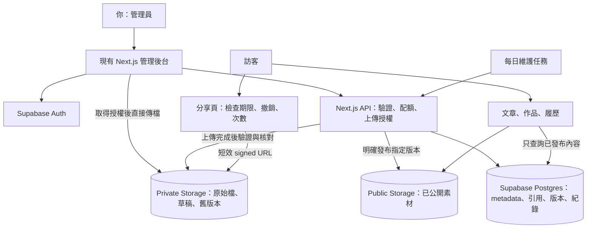
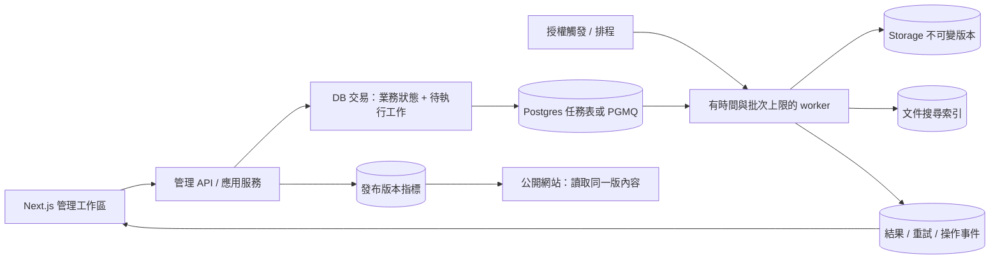

# 個人網站檔案與內容管理延伸研究

研究日期：2026-09-20。基準版本：`d8abb9d`。

狀態：研究與實作提案，尚未修改網站功能、執行資料庫 migration 或部署。

已確認用途：由你自己管理文章、作品與檔案，訪客只看公開展示。第一版不開放訪客註冊、上傳或購買儲存空間。

## 1. 建議方向

把原本的檔案管理專案延伸為網站的「內容與素材管理中心」。圖片、履歷、文章附件與作品截圖使用同一套檔案生命週期：上傳、驗證、引用、發布、版本更新、回收、還原、備份。

第一階段沿用現有的 **Next.js + Vercel Hobby + Supabase Auth / Postgres / Storage**。不新增需要自行管理的 AWS 帳號、S3、RDS、Lambda 或 API Gateway。這裡的「不用 AWS」依你的理由解讀為避免直接採購與管理 AWS 服務；不代表代管平台底層完全不使用 AWS 基礎設施。

真正值得放進作品集的亮點是：同一張圖用在哪些文章能查到、刪錯可以還原、發布不會暴露草稿、上傳失敗可以復原、每次異動有紀錄。這些功能也會每天支援你自己的網站。

## 2. 原專案確認到的內容

目前 `D:\website\檔案管理系統` 資料夾不存在；實際找到的是根目錄的 [檔案管理系統-垃圾桶.pdf](../檔案管理系統-垃圾桶.pdf)，共 11 頁。已讀取文字，並查看第 5、7、9、10 頁的架構與資料表圖片。PDF 被現有 `.gitignore` 排除，不會隨此報告進 Git。

| PDF 頁次 | 能確認的設計 | 對延伸專案的意義 |
| --- | --- | --- |
| 3 | Client 透過腳本與 API 使用上傳、刪除、取得連結 | 改成網站內可操作的後台工作區 |
| 4–5 | S3 上傳、事件觸發 Lambda，再寫入 RDS metadata；第 5 頁將 Lambda 到 RDS 部分標為未完成 | 保留檔案與 metadata 分離的概念，補完整的上傳確認流程 |
| 6–7 | `move_to_trash`、`restore_from_trash`、`delete_permanently`、`scheduled_cleanup`；第 7 頁部分儲存事件與資料庫同步標為未完成 | 垃圾桶、復原與可重試清理是核心延伸 |
| 8–9 | `generate_presigned_url` 與 S3 限時下載；第 9 頁底層儲存下載流程標為未完成 | 改為應用程式分享連結 + Storage 短效下載授權 |
| 10 | `Users`、`Files`、`AuditLogs`、`share_links`、`Plans`、`Subscription`、收藏檢視 | 沿用檔案、紀錄、分享與收藏；第一版不做方案與訂閱 |
| 11 | 權限管理、舊資料轉低價儲存、流量控制、監控、使用分析尚未實現 | 優先補權限、容量與失敗追蹤，冷儲存暫後置 |

**以上是文件呈現的設計，不是舊程式已驗證完成的功能。** 尚未取得該專案原始碼、DDL、測試或 AWS 實際部署資訊，因此目前能承接的是設計與需求，不能承諾直接搬移既有程式。簡報列有三位組員，未來案例頁應分清團隊成果、你原本負責的部分與這次個人延伸。

## 3. 現有網站已經有哪些基礎

| 現況 | 本機程式依據 | 延伸方式 |
| --- | --- | --- |
| Supabase Auth + 管理員 Email 白名單 | `src/lib/auth/admin.ts:24` | 沿用，所有新管理 API 也要驗證，不只保護頁面 |
| 基本 Storage 列表與資料夾 prefix | `src/app/admin/files/page.tsx:62` | 增加資料庫分頁、檔名搜尋、篩選與素材詳情 |
| PNG / JPEG / WebP / GIF / PDF 格式與 magic bytes 檢查 | `src/lib/uploads.ts:11` | 沿用驗證，中文原名與儲存 key 分離 |
| 基本檔案上傳與刪除 | `src/app/admin/files/actions.ts:36` | 上傳加 session，刪除改為垃圾桶 |
| 個人照與中英履歷更新 | `src/app/admin/files/profile-photo/route.ts`、`src/app/admin/resume/actions.ts` | 接入共用檔案版本與引用機制 |
| 文章、作品編輯與發布 | `src/app/admin/articles/actions.ts`、`src/app/admin/projects/actions.ts` | 加素材選擇器、附件與文章版本 |
| `media_assets` 圖片庫資料表 | `supabase/migrations/20260918000000_init.sql:271` | 目前這次檢查的上傳流程未寫入它，需統一資料模型 |
| 每日內容發布排程 | `src/app/api/cron/publish/route.ts`、`vercel.json` | 可另加每日維護任務，保留現有發布職責 |

### 優先處理的缺口

1. **刪除不可復原。** `deleteFileAction` 直接呼叫 Storage `remove()`，沒有垃圾桶或引用檢查，可能刪掉文章正在使用的圖片。
2. **更新不保留舊檔。** 個人照與履歷在新資料寫入成功後刪除舊物件；Git 版本不能還原這些已刪除的 Storage 檔案。
3. **檔案清單不完整。** 目前 `.list()` 固定 `limit: 100`，沒有後續分頁，檔案變多會看不到後面的資料。
4. **沒有完整的檔案 metadata 層。** 原始檔名、引用、版本、刪除狀態與稽核紀錄尚未統一管理。
5. **公開／私有混用的風險。** 現有 `media`、`resume` 都是 public bucket。草稿文章不公開，不代表其已上傳的圖片也不公開。
6. **Vercel 上傳限制不一致。** 本機允許 8 MiB，Next 設定 `bodySizeLimit: '12mb'`，但 Vercel Function 的 request / response payload 限制是 4.5 MB。改 Next 設定不能提高平台限制；這是具體風險，尚未用正式站大檔重現。[Vercel 限制](https://vercel.com/docs/functions/limitations)
7. **兩邊成功狀態可能不同。** 例如照片上傳成功、profile 更新失敗，現有流程可能留下無引用的檔案。需要失敗補償與定期核對。

## 4. 不直接使用 AWS 的方案比較

以下額度於研究日查閱官方文件；未讀取你帳號的實際方案與已使用容量。

| 方案 | 優點 | 成本與限制 | 結論 |
| --- | --- | --- | --- |
| 現有 Vercel + Supabase Free | 登入、資料庫與 Storage 已整合，改動最少 | Supabase 提供 1 GB 檔案、每專案 500 MB DB、5 GB 一般 egress 與另 5 GB cached egress；兩種流量配額不能任意互抵。Free 單檔上限 50 MB | **第一版推薦** |
| Vercel + Supabase DB/Auth + Cloudflare R2 Standard | 儲存容量與大量檔案傳輸較有餘裕 | R2 每月 10 GB-month、100 萬 Class A、1,000 萬 Class B 操作免費，直接 egress 不收費；超額儲存與請求仍計費 | 容量或流量接近上限時再評估 |
| 自架伺服器 / NAS + 物件儲存 | 容量與政策自行控制 | 要維護硬體、電力、外網、TLS、修補、監控及異地備份；軟體免費不等於營運免費 | 不適合目前以個人網站為主的第一版 |

額度依據：[Supabase 定價](https://supabase.com/pricing)、[R2 定價](https://developers.cloudflare.com/r2/pricing/)。R2 免費額度只適用 Standard，不適用 Infrequent Access；所以不要直接照搬舊專案的 Glacier / IA 冷儲存設計。

Vercel Hobby 限個人、非商業用途；超過部分額度可能要等額度恢復。Supabase Free 專案可能在一週未活動後暫停，且不包含自動備份。可以以不增加代管月費為目標，但不能承諾無限容量、無限流量或永久不中斷。[Vercel Hobby](https://vercel.com/docs/plans/hobby)、[Supabase 定價](https://supabase.com/pricing)

R2 啟用要完成訂閱 checkout，按月計量計費；付款設定依帳戶流程確認。容量警示是提醒，不應當成保證不扣款的硬上限。你目前重視避免額外費用，因此不建議第一步就開新計費服務。[R2 啟用](https://developers.cloudflare.com/r2/get-started/)、[Cloudflare 計費政策](https://developers.cloudflare.com/billing/understand/billing-policy/)

## 5. 建議架構與權限

| 舊服務／概念 | 新位置 |
| --- | --- |
| S3 | Supabase Storage |
| RDS / FileMetaData | Supabase Postgres 中的應用資料表 |
| API Gateway + Lambda | 現有 Next.js Route Handlers / Server Actions |
| 上傳後事件同步 | `init -> direct upload -> finalize`，搭配未完成上傳核對 |
| 排程清理 | 每日維護 API + DB 任務紀錄 |
| Presigned URL | 後端檢查後簽發 Storage URL |
| AuditLogs | 自有 `asset_events`，持久保存管理事件 |
| Plans / Subscription | 暫不需要，使用個人總容量設定 |

### 公開與私有分離

- 新增 private bucket，例如 `assets-private`，放所有新上傳原始檔、草稿和歷史版本。
- 沿用 `media` / `resume` 作為已明確發布素材的出口，逐步補齊引用登記；遷移初期保留原網址。
- Private bucket 不開匿名讀取／列舉；管理操作只由驗證過的管理員 API 執行。資料表 RLS 預設拒絕公開存取，公開頁只取經過限制的已發布投影。
- `service_role` 會繞過 RLS，所以每個使用它的 API 都必須先驗證身分、允許的資產及操作。UUID 難猜不能取代權限。
- Public bucket 的檔案持有 URL 就能讀取；在 DB 加 `deleted_at` 不會讓公開 URL 自動失效。公開過的內容也不能保證收回訪客下載副本或快取。[Bucket 存取模型](https://supabase.com/docs/guides/storage/buckets/fundamentals)、[Storage 權限](https://supabase.com/docs/guides/storage/security/access-control)

## 6. 你實際會使用的功能

### 第一版：素材庫與可靠的檔案操作

| 功能 | 具體行為 | 與目前網站的連結 |
| --- | --- | --- |
| 批次上傳 | 拖曳或選檔、佇列、進度、取消、單檔重試 | 個人照、履歷、文章圖與作品圖共用 |
| 中文檔名 | 清單保留原始中文名稱，Storage 使用 UUID key | 避免之前的 `Invalid key` 問題 |
| 搜尋與分類 | 檔名、標籤、格式、日期、收藏、未使用；伺服器分頁 | 不必手動輸入 bucket / prefix |
| 預覽 | 圖片、PDF；後續支援 Markdown 與純文字 | 可直接核對將發布的內容 |
| 垃圾桶 | 刪除先隱藏，顯示刪除日期與還原；永久刪除另行確認 | 防止誤刪 |
| 使用位置 | 顯示「用於某篇文章、某個作品、中文履歷」 | 被引用的檔案不能直接永久刪除 |
| 版本管理 | 同一資產上傳 v2，保留 v1，指定要發布的版本 | 更新履歷或圖片後可切回 |
| 操作歷程 | 上傳、驗證失敗、發布、取消發布、更新、回收、還原與清理結果 | 對應你要保留發生紀錄的要求 |

### 第二版：把素材管理融入寫作與作品編輯

文章編輯器新增素材選擇器，選圖後自動插入引用、設定中英 alt text；PDF 作為附件，Markdown 可匯入文章草稿。作品封面、架構圖、gallery 都從同一素材庫選取。

不要讓「換一個資產版本」無聲地改掉所有文章。文章引用預設綁定具體版本；更新時列出受影響頁面，由你選擇同步哪些引用。公開文字、素材引用與發布指標需一起建立可追蹤的版本。

### 第三版：對外分享與作品展示

分享頁支援有效期限、撤銷與可選密碼；訪客只得到你指定的某個檔案版本。公開作品頁介紹架構演進，另提供隔離的互動示範：訪客可在瀏覽器內操作範例檔案的搜尋、回收與復原，不接觸真實管理資料，也不消耗正式 Storage 寫入額度。示範需明確標示是範例環境。

這能同時展示前端互動品質與後端工程判斷，比只有一張架構圖更容易理解你的能力。

## 7. 後台介面設計

沿用網站字體、Logo、明暗主題與元件，檔案工作區採較密集的工具介面：左側分類、中間列表、右側選取檔案詳情。頁首提供搜尋、篩選、排序和上傳；詳情中有預覽、使用位置、版本及歷程。

- 桌機主要採 table / list，圖片可切 grid；不把每個區塊做成大卡片。
- 工具使用 lucide 的上傳、複製、下載、還原、垃圾桶圖示，提供 tooltip 與 accessible name。
- 手機將分類收進選單，詳情改成獨立頁或 sheet；保留名稱、狀態與主要操作，不硬擠桌機所有欄位。
- 使用者能看出「上傳中」「驗證中」「可用」「失敗可重試」「已回收」，錯誤要對應下一個可執行動作。
- 長中文檔名換行或省略，詳細名稱可檢視；工具列與操作按鈕固定尺寸，避免狀態改變造成位移。
- 拖曳不是唯一操作方式，鍵盤、手機選檔與螢幕閱讀器都能完成主要流程。

建議路由：`/admin/files`、`/admin/files/[id]`、`/admin/files/trash`、`/admin/files/activity`。公開分享可使用 `/[locale]/share/[token]`，沿用雙語路由；分享頁與管理頁不進 sitemap，分享頁設定 noindex。

## 8. 資料模型草案

這是實作時的契約草案，不是可以直接套用的 migration。分階段新增；不一次建立尚未使用的所有表。

| 表 | 主要欄位／責任 | 階段 |
| --- | --- | --- |
| `assets` | UUID、owner、原始／顯示名稱、folder、tags、favorite、current version、deleted_at、revision | 1 |
| `asset_versions` | asset_id、version_no、provider、bucket、object_key、size_bytes、mime、SHA-256、validation status、created_at | 1 |
| `upload_sessions` | admin_id、asset/version、固定 object key、預留 bytes、idempotency key、expires_at、status、error | 1 |
| `asset_events` | event_id、actor、asset/version、action、outcome、request_id、必要 before/after、timestamp | 1 |
| `asset_usage` | version_id + post/project/profile 外鍵、用途 slot、發布 artifact key | 1，逐步接入編輯器 |
| `folders` | owner、parent、name、排序；邏輯分類，不綁 Storage 路徑 | 1 後段 |
| `asset_jobs` | 驗證／發布／刪除／核對任務、status、attempts、lease、last_error、next_run_at | 跨 Storage 操作開始時 |
| `asset_share_links` | 隨機 token 的 hash、固定 version、expires_at、revoked_at、可選 password hash、兌換次數／上限 | 3 |
| `post_revisions` | post_id、revision、完整文章快照、引用快照、actor、created_at | 2 |

設計約束：

- `asset_versions` 的 `(asset_id, version_no)` 與 `(provider, bucket, object_key)` 唯一；檔案 bytes 使用 `bigint`。
- `current_version_id` 必須屬於該資產；以適當外鍵／交易約束，不能只靠 UI。
- `asset_usage` 使用可驗證外鍵，例如 nullable `post_id` / `project_id` / `profile_id` 配合「恰好一個非空」CHECK，避免無法約束的任意字串 owner。
- 上傳完成、quota 扣抵、current version 切換與成功事件，在同一 Postgres transaction / RPC 中處理。RPC 限制執行權限；不得無條件公開 `security definer`。
- 版本切換採 revision / optimistic concurrency，避免兩個分頁互相覆蓋。folder 移動需檢查循環。
- 儲存路徑由伺服器產生，例如 `ownerUUID/assetUUID/versionUUID.jpg`，原始檔名獨立保存；改名與移動資料夾不用搬動所有物件。
- 不再平行維護兩個素材真實來源。`media_assets` 需先查實際資料，再決定轉入 `assets` 或暫設相容查詢；不能因程式沒用到就假設線上表是空的。
- 資產永久刪除也保留非敏感 tombstone 與事件識別資料；避免 FK cascade 刪掉歷史。

## 9. 核心流程與失敗處理

### 9.1 上傳：不讓大檔經過 Vercel request body

1. 瀏覽器傳小型 JSON 至 `POST /api/admin/assets/uploads`：原始名稱、預期大小與類型。
2. 後端驗證管理員、同源請求、白名單、配額；以 DB transaction 預留容量與固定 object key，回傳 scoped upload token。
3. 瀏覽器直接傳到 private Storage。超過約 6 MB 或需要進度／續傳時使用 `tus-js-client`，依官方 TUS 設定實作，不自行發明分塊協定。[Supabase 續傳](https://supabase.com/docs/guides/storage/uploads/resumable-uploads)
4. 呼叫 `POST /api/admin/assets/uploads/[id]/complete`。伺服器從可信 Storage metadata 與實際 bytes 核對大小、magic bytes、hash；不得只相信 client 說「傳好了」。初期限制檔案大小，控制驗證的記憶體與時間。
5. 驗證成功才將 version 設為 ready，提交容量與事件；重送 complete 回同一結果，不建立重複版本。
6. 傳完卻沒 finalize 的檔案，保持 private / pending；每日核對可以補驗證或列入待清理。網路中斷不應讓它誤上線。

Signed upload URL 官方有效期是 2 小時。應用 session 可以有自己的狀態，但不能把 DB session 過期當成底層 token 立即撤銷。固定唯一 key、禁止 upsert，待 token 過期且沒有有效續傳後再清理，避免舊 token 重建物件。[Signed upload URL](https://supabase.com/docs/reference/javascript/file-buckets-createsigneduploadurl)

直傳前的瀏覽器壓圖是體驗最佳化；真正的檔案驗證仍在後端。格式驗證也不等於完整防毒。第一版僅管理員可上傳既有圖片格式與 PDF；後續新增 Markdown / TXT 時視為文字處理，不執行內容。

### 9.2 發布與引用

1. 文章或作品先選取 ready 的 private version，建立草稿引用。
2. 點發布時驗證所有素材，產生必要的 public 副本／壓縮圖；副本 key 不覆寫舊版本。
3. 確認公開物件存在後，再在 DB transaction 更新文章發布狀態與版本引用，最後清除對應快取。
4. 任一步驟失敗，保留原本對外版本，讓任務可重試；已產生但未引用的 public 副本記為待核對。

Postgres transaction 不能同時回滾 Storage。這裡使用明確狀態、任務與補償處理，不宣稱跨服務原子交易。Private 原件的刪除、移動與複製只能走 Storage API，不能直接刪 `storage.objects` 當成刪檔。[Storage schema](https://supabase.com/docs/guides/storage/schema/design)

### 9.3 垃圾桶、還原、永久刪除

- 垃圾桶首先更新 `deleted_at`，private 原物件不移動，避免多一次搬移和路徑變化。
- 還原清除刪除標記並記錄事件。原資料夾已刪除時回到根目錄，向使用者提示。
- 有草稿、已發布內容或仍需保留的文章版本引用時，阻擋永久刪除並列出引用位置。
- 若要刪除公開素材，必須先取消相關發布／更換引用，處理 public 副本；只改 private metadata 不會撤回 public URL。
- 永久刪除先轉為 `purging`、停止簽發下載，成功移除所有目標物件後才標記完成、釋放容量；部分失敗保留任務可重試。
- 還原與 purge 透過 DB 狀態鎖定，不能同時成功。成功刪除前不能先寫「已清除」紀錄。
- 預設**不自動刪除歷史版本與垃圾桶內容**。容量不足就停止新增並提示處理；未來由你啟用保留期與清理政策，且先完成備份驗證。

### 9.4 分享連結

`/[locale]/share/<random-token>` 先核對 token hash、檔案狀態、期限與撤銷狀態。通過後再簽發例如 60 秒的 private Storage download URL；回應設 `no-store`，不把 token 寫進事件內容或分析工具。

「撤銷分享」阻止後續兌換；先前已簽發的下載 URL 要按其 TTL 看待，不能承諾立即作廢。若將來真的需要每次讀取都能即時撤權，要另設檔案代理並重算平台與流量限制。

下載次數第一版稱為「下載連結兌換次數」，用 DB 原子更新限制，避免兩個並行請求超額；瀏覽器拿到 signed URL 不等於完成整份下載，也不能當作一次性 bytes 存取保證。密碼功能採成熟的 password hashing 實作及速率限制。

### 9.5 排程與監控

新增每日 maintenance endpoint，用 `CRON_SECRET` 驗證。分批處理過期上傳、孤立物件核對與已允許的清理；每批有 cursor、lease、嘗試次數與錯誤摘要，重複呼叫不造成重複扣額。

Vercel Hobby 的每個 cron 最多每天執行一次，且不保證精確分鐘。分享過期必須在請求當下判斷，不能等隔天排程才失效；清理延後也不應影響權限。管理後台顯示最後成功執行時間與待處理數量。[Vercel Cron 限制](https://vercel.com/docs/cron-jobs/usage-and-pricing)

## 10. 技術文章怎麼融入

現有文章存在 `posts` 的中英 Markdown 欄位，應繼續保留。檔案管理負責素材和附件，不能把整篇文章只存成一個不可搜尋的 PDF。

| 輸入 | 建議行為 |
| --- | --- |
| 在後台寫 Markdown | 原有編輯器 + 素材選擇器 + 預覽 + 修訂歷史 |
| 上傳 `.md` / `.txt` | 建立草稿；選用的 front matter 用成熟 parser，驗證 title / slug / tags，不能帶入自動發布命令 |
| 上傳 `.pdf` | 作為附件，填寫標題與摘要；轉成網頁文章是另一項明確工作 |
| 插入圖片 | 以固定版本引用，產生可渲染 URL，登記使用位置與中英 alt |
| 更新文章 | 保存前一版文字與引用快照，提供差異檢視與還原 |

Markdown 原始 HTML 不開啟任意執行。管理素材引用需透過 Markdown AST / 已使用的 remark 生態解析，不用正規表示式草率掃圖。外站圖片標記為「外部連結」，不要隨意由伺服器抓取任意 URL。

還原文章預設先成為草稿，讓你檢查後重新發布。保留修訂與保留該修訂引用的檔案是兩個責任；清理器必須理解「仍被保留版本引用」的關係。

## 11. 紀錄、版本與備份

| 要還原什麼 | 正確保存位置 |
| --- | --- |
| 網站程式、樣式、migration | Git commit / tag |
| 文章文字與發布資料 | DB 中的 revisions + 獨立 DB 備份 |
| 照片、PDF、附件 bytes | Storage 的 version 物件 + 異地檔案備份 |
| 發生過什麼操作 | `asset_events` 與內容修訂事件 |

應用事件採追加紀錄，保存操作者、時間、物件、動作、結果及 request ID；不存密碼、完整 signed URL 或 access token。成功 metadata 異動與成功事件同一交易；如果 DB 本身故障，不能承諾把失敗也成功寫進 DB，需回報 request ID、保留可取得的平台錯誤並在恢復後核對。

檔案操作紀錄不能取代備份，也不等於完全不可竄改的合規 audit log。第一版保存所有管理異動，不記每個滑鼠操作；網站訪客瀏覽分析採統計，避免大量 request logs 撐滿小型 DB。

**DB dump 不包含 Storage 真正的檔案。** 免費專案應定期匯出 DB，另下載 Storage objects，保存對照 manifest 與 checksum。可以使用 Supabase CLI / 官方列出的 Storage 工具做檔案匯出；備份路徑放在不進 Git 的本機或獨立備份位置，不放進公開網站。[Supabase 備份](https://supabase.com/docs/guides/platform/backups)、[Storage 匯出](https://supabase.com/docs/guides/storage/management/download-objects)

建議每次大批內容更新後備份，平常每週一次，並做至少一次「空白測試環境還原 DB + 檔案 + 引用」演練。可接受的資料損失時間取決於最後一份成功備份，不是只要有 Git 就完全不會丟資料。

## 12. 免費額度怎麼控制

建議應用層先設以下初始值，這些是產品設定提案，不是平台保證：

- 總檔案容量軟上限約 800 MB，預留平台額度給現有素材、縮圖與暫存；以全部 bucket 的實際使用量校正。
- 圖片維持 8 MiB 以內；PDF 初期最多 20 MiB，需同步設定 bucket 和前後端限制。直傳完成前不開放大型影片／資料集。
- 已驗證檔案、舊版本、垃圾桶、公開副本及上傳預留都計入容量；不是只加總目前列表。
- 到達 70% / 85% 顯示提示；新增或新版本會超過預算時阻擋，不自動刪舊檔。
- 公開圖片先壓縮、延遲載入，列表只取小型 metadata、縮圖按需取用。Free Storage 不含圖片轉換服務，不能把它當成免費功能。[Supabase 定價](https://supabase.com/pricing)
- 不開放匿名上傳；分享簽發加總量與單連結限制。多執行個體共用 DB 計數，不把記憶體 Map 當作正式速率限制。
- 用每月 provider usage 檢查真實 egress。應用下載計數無法精確推算 CDN 快取、range requests 和所有流量，不承諾藉由 UI 配額完全擋住平台超額。
- 核心流程不依賴付費 AI API。現有翻譯是可選能力；OCR、摘要、向量檢索待有資料量與預算再做。

示例容量估算：120 張圖片 × 每版 0.6 MB × 3 版 = 216 MB；10 份文件 × 8 MB × 2 版 = 160 MB；120 張公開縮圖 × 0.2 MB = 24 MB，合計約 400 MB。這還沒算你現有資料、額外公開文件副本與備份。版本無限增長必然會碰到免費容量上限。

流量另算：假設每次訪問下載 6 MB、每月 300 次，約 1.8 GB。這只是示例，不是已量測流量；需要再加 PDF 下載、重試、管理預覽與備份傳輸。快取命中與未命中要分別觀察。

當實際容量長期接近預算，先檢查大型原件、重複公開副本與孤立檔；再決定手動封存或採 R2。為將來遷移預留 `provider/bucket/object_key` 欄位即可，第一版不必先做完整多雲儲存框架。

## 13. 實作順序與版本保護

| 階段 | 交付 | 驗收重點 | 粗估投入 |
| --- | --- | --- | --- |
| 0：盤點與備份 | Storage / DB manifest、引用盤點、還原點、測試素材 | 能還原；知道哪些檔已公開 | 1–2 工程日 |
| 1：可靠素材庫 | private bucket、metadata、直傳與 finalize、分頁、垃圾桶、版本、events | 大檔不穿過 Vercel；失敗可重試；舊版仍在 | 4–7 工程日 |
| 2：內容整合 | 文章／作品／履歷素材選擇、引用阻擋、內容 revisions、發布驗證 | 不破壞現有網址；可還原內容與素材 | 3–5 工程日 |
| 3：分享與展示 | 分享頁、期限撤銷、容量頁、維護任務、公開隔離 demo 與案例 | 訪客碰不到管理資料；實測成果可展示 | 3–5 工程日 |

估算總計約 11–19 工程日，包含驗證，不是交付保證；原始碼可否取得、線上現存資料量及額外格式需求會影響時程。

遷移原則：

1. 開始實作前以 Git 保存當下版本，另備份 DB 和 Storage。記錄目前線上 deployment 與必要環境設定名稱，不匯出秘密到文件。
2. 新增 migration；不改寫已套用的 init migration，也不靠 seed 重設真實內容。
3. 分頁盤點現有 `media` / `resume`、profile、posts、projects、project_media 與實際 `media_assets`；以 `(provider,bucket,key)` 做冪等 backfill。
4. 舊檔名可能已失去中文原名，匯入時保留現有名稱，不能假裝重建未知原名；無法確定的歷史時間也標記為未知。
5. 新上傳先走新流程；舊公開 URL 持續可用。所有新增／替換引用接入前，不啟用會根據「零引用」永久刪除的清理器。
6. 以後台 feature flag 或新入口逐步切換；每階段獨立 commit，明確列出驗收結果與退回方式。
7. 回滾程式前，確認舊程式不會刪掉新版本管理中的物件；必要時暫停管理寫入，保留新增表與物件供修復。不要用 down migration 直接清掉新內容。

現有網站與使用者操作不在這次研究中變更；本報告不是授權現在就清理、改公開權限、推 migration 或發布。

## 14. 具體程式改動範圍

| 路徑 | 預期工作 |
| --- | --- |
| `src/app/admin/files/*` | 新列表、詳情、版本、回收與活動頁；逐步替換目前的直接 upload / delete |
| `src/lib/uploads.ts` | 保留純函式驗證；拆開原始顯示名、儲存 key 與檔案限制 |
| `src/lib/assets/*`（新增） | 檔案生命週期、授權、引用、容量與 Storage 操作；只有重複流程才抽共用函式 |
| `src/app/api/admin/assets/*`（新增） | init / complete / preview / publish / trash / restore / purge / share |
| `src/app/admin/articles/article-form.tsx` | 素材挑選、Markdown 匯入、附件與修訂 |
| `src/app/admin/projects/*` | 封面、架構圖與 gallery 的版本引用 |
| `src/app/admin/files/profile-photo/route.ts`、`src/app/admin/resume/actions.ts` | 透過共用生命週期保存版本，不再立即刪掉舊檔 |
| `src/app/[locale]/articles/*`、`projects/*`、`contact/*` | 讀取已發布素材及附件，保持雙語與現有 URL |
| `src/app/api/cron/assets-maintenance/route.ts`（新增） | 小批次維護與可重試任務 |
| `supabase/migrations/*` | 分階段資料表、索引、RLS、RPC 與 bucket 設定 |
| `src/types/database.ts`、`tests/*` | 更新型別，加入流程、DB 與瀏覽器測試 |

## 15. 何時才算做好

- 未登入者無法列出 private 檔案；一般登入帳號也不能呼叫管理 API；客戶端沒有 service key。
- 中文名稱與同名檔可上傳；空檔、偽裝格式、超限檔被拒絕；總容量並行預留不超賣。
- 真實測試部署中 5–8 MB 圖片與較大 PDF 直傳成功；重送 complete 不重複建立版本。
- 超過 100 筆可正常分頁；清單可區分 pending、ready、failed、trashed。
- 回收能還原；引用中的資產不能永久刪除；清理和還原並行時結果一致。
- 上傳成功後 DB 更新失敗、public copy 失敗、刪除部分失敗，都有可核對且可重試的處理。
- private 草稿沒有被塞進 public bucket，尚未完成發布的素材不會出現在公開頁。
- 分享過期／撤銷立即停止新的簽發；UI 說清楚已簽發 URL 的短暫有效期，統計不冒稱實際下載完成。
- 文章／作品更新後快取失效，相關頁能讀到新版本；還原舊文時素材也還在。
- 自動清理預設關閉；備份含 DB、檔案與引用 manifest，還原演練通過。
- 桌機與 360 / 390 / 768px 等手機、平板視窗以 Playwright 驗證無橫向溢出，並測試鍵盤、長檔名、上傳失敗與空列表。
- 執行 typecheck、lint、單元／DB 整合、E2E、production build；Supabase 與 Vercel 的真實限制另外在測試部署驗證，不能只靠 mock。

對外案例可展示實測的上傳成功率、列表查詢時間、誤刪復原時間、儲存與流量使用量。先記錄環境、樣本與方法，再公布結果，不預先寫漂亮的效能數字。

## 16. 本次研究的限制與下一步

已檢查本機網站相關程式、migration、測試檔與舊 PDF；未登入 Supabase / Vercel、未量測正式站、未取得舊專案原始碼。價格與能力以文中官方連結為準，實作前若間隔較久需再核對。

建議下一個實作里程碑是「版本可還原的私人素材庫」：盤點與備份、直傳、metadata、引用保護、版本、垃圾桶、紀錄，接通目前照片與履歷操作。完成後再接文章編輯器、分享與公開展示。這一順序能先解決真實使用風險，也讓每一版都有可驗收的成果。

## 17. 進階功能：用實際行為展示技術力

本節回應後續的進階研究需求，仍是提案，並非已上線功能。重點是能解決真實問題、有清楚的正確性條件，且可用測試與數據展示。以下為基礎素材庫完成後的選項，不全部併入第一版。

### A. 整份內容發布與回滾

使用情境：一篇文章包含文字、三張圖片和一份 PDF。你需要把這一組內容一起發布、一起回到上一版，避免只還原文字卻找不到當時的圖片。

設計為 immutable release manifest，記錄內容修訂、指定素材版本、語言與建立者。發布前檢查引用與公開檔案可用性；全部準備好後，用 DB transaction 切換 `published_release_id`。讀取頁面時固定使用同一 release，不能混讀各欄位的最新值。回滾時切回仍可用的舊 release，再處理快取更新。

DB 的發布指標可以原子切換，但 Storage 複製與全球 CDN 快取不在同一交易內。訪客可能暫時讀到完整舊版，不能因此承諾所有訪客同一毫秒切換。已公開檔案仍遵守前文的公開快取與撤回限制。

驗收／展示：刻意讓 PDF 發布步驟失敗，前台依然能讀完整的前一版；修正後重新發布，再一鍵回滾。記錄檢查時間、發布時間、失敗率與回滾時間。

**展示能力：內容版本設計、資料一致性、交易邊界與可逆發布。**

### B. 有持久狀態的背景工作與失敗復原

使用情境：檔案已上傳，但縮圖、文字擷取或搜尋索引更新失敗；重新整理頁面後仍能看到任務，並從適當步驟重試。

將「資料狀態變更」與「待執行工作」放在同一個 DB transaction。可以用前文的 `asset_jobs` 先實作 outbox，或在同一 RPC 中直接 enqueue 至 `pgmq`；初期擇一作為任務的權威來源，避免雙重排程。後者是 Supabase Queues 所用的 Postgres extension，不必另外部署 Redis。[Supabase Queues](https://supabase.com/docs/guides/queues)

工作以 `asset_version + task_type + processor_version` 作唯一鍵；加入 lease / visibility timeout、attempt、退避重試及 dead-letter 狀態。只有副作用與結果可確認成功後才完成／ack。若執行者在「物件寫完、ack 前」中斷，下次重試必須核對相同輸出，不能重複建立版本或重複扣額。

Queue 在 visibility window 內的單次訊息交付，不等於跨 DB / Storage 的副作用 exactly-once。整體仍按可能重送設計。轉移過期 lease、寫入任務結果時加 claim token / generation 檢查，避免舊執行者在新執行者接手後覆蓋結果。[PGMQ 語意](https://supabase.com/docs/guides/queues/pgmq)

驗收／展示：測試環境連續注入兩次 timeout、在副作用後中斷一次執行者；最終只留一個正確輸出，任務時間軸可看到每次嘗試與原因。

**展示能力：冪等、非同步處理、並行控制、錯誤補償與可靠性設計。**

### C. 檔案去重與可驗證的容量管理

使用情境：同一張架構圖在五篇文章出現，或同一份 PDF 改名上傳多次，系統可以辨識相同 bytes，減少不必要的副本。

進階版才把實體 `blobs` 與邏輯 `asset_versions` 分離：版本指向 blob，blob 保存 Storage key、已驗證 SHA-256 與 bytes。去重限定同一 owner / 存取範圍；不能藉 hash 查詢洩漏他人是否有某個檔案。瀏覽器 hash 可作提示與進度處理，伺服器仍核對實際檔案；同時上傳的重複物件透過 DB 唯一約束選定 canonical blob，安全處理多餘副本。

需要分清邏輯引用量與實體儲存量。舊版本、文章快照、未到期分享都可能引用 blob；回收不是把計數減到零就立即刪除。先標記候選、經過寬限期，再於刪除流程中鎖定並重查引用；被標為刪除中的 blob 不得再接受新引用。

驗收／展示：連續與並行上傳相同檔案，實體私有原件只保留一份；刪除其中四個引用，第五個仍可下載。私有原件與公開衍生圖需分開計量，不能宣稱全系統一定只有一個副本。

**展示能力：內容定址概念、正規化、資料完整性、垃圾回收與成本量測。** 等量測出重複檔案確實占容量後再做，比第一版就改儲存模型更合適。

### D. 可搜尋內文、可定位來源的個人知識庫

使用情境：輸入「資料庫索引」能找到技術文章、研究 PDF 與作品筆記，結果顯示命中段落，點擊定位到原頁／標題。

先建立 `document_chunks`：內容所屬版本、頁碼或標題、段落序號、文字、索引版本與可見狀態。Markdown 用 AST，文字型 PDF 用成熟解析器；掃描 PDF 沒有可取文字時要明確標示需 OCR，不應顯示為已完整索引。PDF 解析限制頁數、bytes 與執行時間。

英文可採 Postgres full-text search，加權標題、標籤與正文；檔名／標題模糊查詢可評估 `pg_trgm`。中文要另外設計切詞或子字串回退，不能假設英文全文索引就有好的中文斷詞。短查詢是否能用 trigram 索引要實測。[Postgres 全文搜尋](https://supabase.com/docs/guides/database/full-text-search)、[pg_trgm](https://www.postgresql.org/docs/current/pgtrgm.html)

查詢必須在排名、摘要與計數之前套用存取權限。公開搜尋只看當前已發布版本；管理搜尋需登入。取消發布或回收時，即使背景索引清理尚未完成，也要由權限／發布條件立即阻擋舊結果。已淘汰版本的索引任務不能覆蓋新版本。

先用 30–50 筆固定中英文查詢建立測試集，量測 Recall@5、排名品質與 p95 latency。全文搜尋不足時，再評估全文 + 向量的 hybrid search；模型、embedding 版本、重新索引成本與向量空間都需計算。未使用付費 API 不等於 embedding 沒有運算成本。

**展示能力：文件處理管線、索引設計、搜尋評估、資料更新一致性與權限過濾。** 這項最能延伸你的 Data 方向，且不用先做聊天機器人。

### E. 草稿復原與衝突處理

使用情境：同一篇文章在兩個分頁修改，或寫到一半網路中斷。系統保留內容，不能最後儲存者無聲蓋掉另一份修改。

每次儲存帶上 base revision，DB 用 compare-and-swap 更新；不符合回傳 `409 Conflict` 與最新 revision。前端保留兩份草稿與共同基底，用成熟 diff 工具展示差異，讓你決定要採用哪份或手動合併。第一版不需要多人即時 CRDT。

可加 IndexedDB 本機草稿，自動儲存並顯示「本機已存／雲端已同步」。重新連線只同步同一使用者的草稿，採 mutation id 避免重送；登出時提供本機私人內容清理。瀏覽器儲存可能被清除，本機草稿是復原輔助而非正式備份；不能保證分頁關閉後所有瀏覽器都持續同步。

驗收／展示：兩個分頁同時儲存，第二個出現差異檢視；離線輸入後重開同一瀏覽器仍可復原，登入與連線恢復後再確認同步。

**展示能力：前端狀態、樂觀鎖、離線資料管理與衝突 UX。** 並行更新應以 DB 語意保護，不只禁用前端按鈕。[Postgres 交易隔離](https://www.postgresql.org/docs/current/transaction-iso.html)

### F. 真正能定位問題的營運面板

使用情境：再次出現「Failed to fetch」，你能查到是授權失敗、上傳中斷、驗證失敗、DB 儲存失敗還是背景處理卡住。

為每個業務操作產生 operation ID，串連 API、upload session、queue attempts 與事件。管理頁顯示步驟時間軸、目前狀態、最後錯誤與可重試動作。需要細部效能調查時加 Next.js 15 支援的 OpenTelemetry spans；雲端 trace 儲存服務是否收費需另查，初期可在本機 collector 檢視。[Next.js 15 OpenTelemetry](https://nextjs.org/docs/15/app/guides/open-telemetry)

指標定義要固定，例如上傳成功率以「開始的有效 upload sessions」為分母，明確區分取消與逾期；背景任務量測等待時間、處理時間與永久失敗數。p95 必須附時間窗與樣本數，小量樣本不足時不硬下結論。bytes savings 以實際物件盤點核對，不能把「產生下載 URL」算成完整下載。

所有管理異動仍按前文保存；高頻效能 traces 可抽樣、短期保留並匯總。面板不顯示 token、signed URL、私人檔名或訪客識別資料到公開頁。以 request / operation ID 連結資料，不宣稱瀏覽器直傳流量會自動出現在伺服器 trace。

驗收／展示：注入一個受控錯誤，從 UI 的錯誤代碼追到失敗步驟與重試結果。公開案例只呈現去識別的測試資料、測量方法與結果。

**展示能力：可觀測性、效能分析、資料品質與事故排查。**

### G. 備份還原演練與故障測試

使用情境：雲端檔案被誤刪、資料表遷移失敗或換平台時，你能證明完整內容能還原，而不是只有一份未驗證的備份。

匯出 DB、物件 manifest 與 checksums，還原至隔離的本機或測試環境，再檢查檔案總數、引用有效性、checksum、文章渲染與 private 權限。備份需有一致的時間界線；第一版可短暫暫停管理寫入，或以固定快照配合不可變物件收集，避免備份途中被 purge。

將故障注入限制在測試環境：重送同一請求、Storage timeout、寫完物件卻尚未 ack、還原與清理同時執行。測試不變條件，例如「被引用的版本不能被清掉」「成功事件不能早於成功提交」「分享過期不再簽發」。

驗收／展示：公開一份可重現測試報告，說清楚測試資料、故障、預期、實際結果、恢復耗時與可接受資料損失。記錄實測 RTO / RPO，不能先承諾零資料損失或固定復原秒數。

**展示能力：災難復原、測試設計、發布管理與工程證據。**

## 18. 進階架構仍然保持輕量

建議保留單一 repository 和主要 Next.js 部署，把程式責任分成「內容／發布」「素材／版本」「背景工作」「搜尋」「操作紀錄」。各模組使用明確函式與契約，跨服務檔案操作集中在素材模組。先採模組化單體，只有確實需要不同執行環境的 worker 才獨立部署。

### 免費部署時 worker 到底在哪裡執行

- Queue 不會自己執行程式。小型同步驗證可在正常請求內完成；較長工作先寫持久任務，再由有界的 consumer 執行，不依賴回應後無人等待的 Promise。
- 初期低頻任務可以使用管理員主動觸發的 Node consumer，加上原本每日維護來補償。前端可輪詢狀態；UI 需明確顯示等待，不能宣稱即時背景完成。
- 需要分鐘級自動處理時，可評估 Supabase Cron + `pg_net` 呼叫 worker / Edge Function。這與 Vercel Hobby 的每日 cron 是不同服務；實作時核對專案可用能力與額度。[Supabase Cron](https://supabase.com/docs/guides/cron)、[排程 Functions](https://supabase.com/docs/guides/functions/schedule-functions)
- 呼叫管理 consumer 需要伺服器專用授權；公開 publishable key 不能單獨授權管理工作。秘密存伺服器環境或 Vault，不能出現在 client、SQL log 或報告中。
- Edge Functions 受 CPU、記憶體、時限與套件支援限制，不適合直接承諾大量 OCR／圖片轉檔。重型處理應另評估 Node、有界本機 worker 或經允許的其他算力；本機 worker 只在電腦開機運作時提供服務。[Functions 限制](https://supabase.com/docs/guides/functions/limits)
- Postgres queue、索引、任務與 logs 共用現有 DB 容量；cron 呼叫消耗函式資源。上述做法省去額外服務的固定月費，但不代表任何工作量都免費。重試設上限並避免密集空輪詢。

## 19. 推薦取捨與展示順序

| 順序 | 升級 | 開始條件 | 展示成果 |
| --- | --- | --- | --- |
| 第一優先 | B 背景復原 + F 操作時間軸 | 基礎上傳、版本與驗證可用 | 模擬失敗後正確恢復，無重複副作用 |
| 第二優先 | A 整份內容發布／回滾 | 引用、文章修訂與 public 發布流程可用 | 完整文章與素材一起切換版本 |
| 第三優先 | D 文件內文搜尋 | 有一批真實文章／PDF，權限規則已定義 | 命中段落與來源定位，加搜尋評估 |
| 隨使用需求加入 | E 草稿復原與衝突 | 經常在後台寫長文或多分頁 | 離線不丟輸入，衝突可見可處理 |
| 實測後再做 | C 去重 | 重複檔案占用確有影響 | 以實體容量證明節省效果 |
| 每次重要升級一起做 | G 還原與故障測試 | 有新資料模型或跨服務流程 | 可重現、可核對的復原與正確性報告 |

最適合你的作品定位是：**具有可恢復發布流程與來源可追溯搜尋的個人內容平台**。先用實際網站驗證可靠性，再把匿名測試資料與隔離互動展示放到 Projects；不用為單一管理員先加入微服務叢集、Kubernetes、Kafka、多人協作或完整 event sourcing。未來若有真實負載或多人需求，再以量測結果決定升級。
